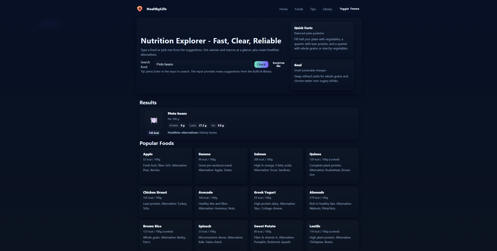

# HealthyLife - Nutrition Explorer

HealthyLife is a fast, clear, and reliable web app for exploring nutrition information. Search for foods, view calories, macros, and get healthier alternatives instantly. Designed for learning and prototyping, it provides an intuitive interface with autocomplete suggestions and random healthy food ideas. Ideal for students, hobbyists, or anyone looking to make smarter food choices. Built with HTML, CSS, and JavaScript for a responsive and modern experience.

## ScreenShots


## Features

- Search for foods and see nutritional information
- Random food suggestions for inspiration
- Autocomplete from a built-in food library
- Light and dark theme toggle
- Mobile-friendly and responsive design

## Tech Stack

- HTML5
- CSS3 (with modern variables and gradients)
- JavaScript (for interactive search and theme toggle)

## How to Run Locally

1. Clone or download the repository
2. Navigate to the project folder in terminal
3. Run a local server (Python example):  
   ```bash
   python -m http.server 8000
Open http://127.0.0.1:8000 in your browser

License
This project is open for learning and prototyping purposes. All data shown are example values.